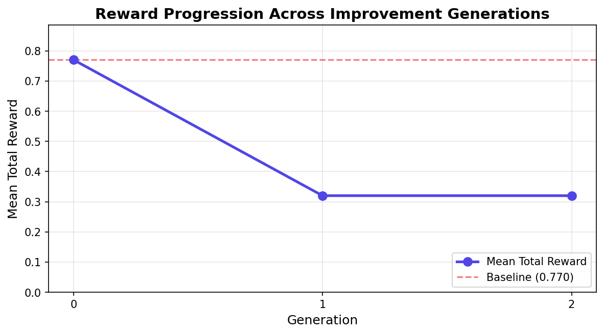

> **🚀 Live Environment:** [akshar-3011-meta-environment.hf.space](https://akshar-3011-meta-environment.hf.space)
> **📦 GitHub:** [akshar-3011/meta-environment](https://github.com/akshar-3011/meta-environment)
> **📓 Colab Training Notebook:** [colab_training.ipynb](https://github.com/akshar-3011/meta-environment/blob/main/colab_training.ipynb)
> **📝 Mini-Blog / Video:** _Coming soon_

<div align="center">

# 🏢 Meta-Environment

### Production-Grade RL Environment for Customer Support Triage

Train and evaluate AI agents on real-world email triage workflows — classify intent, draft empathetic replies, and make escalation decisions — with dense per-step rewards, 100 validated scenarios, and sub-millisecond latency.

[](https://github.com/akshar-3011/meta-environment/actions/workflows/ci.yml)
[]()
[]()
[](https://github.com/meta-pytorch/OpenEnv)
[]()
[]()
[]()

[Quick Start](#-quick-start) · [Features](#-features) · [Benchmarks](#-benchmarks) · [Training](#-train-an-rl-agent) · [API Docs](#-api-endpoints) · [Contributing](#-contributing)

</div>

---

## ⚡ Quick Start

### Fastest Path (3 commands)

```bash
git clone https://github.com/akshar-3011/meta-environment.git && cd meta-environment
pip install -e ".[dev]"
python examples/01_quickstart.py
```

### Docker (2 commands)

```bash
docker build -t meta-env .
docker run -p 8000:8000 meta-env
# → http://localhost:8000/health  ✅
# → http://localhost:8000/docs    📖
```

### Verify Installation

```bash
curl -s http://localhost:8000/health | python3 -m json.tool
# {"status": "ok"}
```

---

## 🎯 Features

| Category | Capability |
|---|---|
| **Environment** | 3-step episodes: `classify → reply → escalate` with dense rewards |
| **Scenarios** | 100 validated scenarios across 3 difficulty levels (easy/medium/hard) |
| **Rewards** | Configurable weighted grading: 40% classify, 35% reply, 25% escalate |
| **A/B Testing** | Experiment framework with 4 reward policies + statistical analysis |
| **Training** | Gymnasium wrapper + multi-agent PPO pipeline (conservative/aggressive/balanced) |
| **Observability** | Prometheus metrics, OpenTelemetry tracing, structured audit logging |
| **Security** | API key auth, per-endpoint rate limiting, CSP/HSTS headers, error sanitization |
| **Deployment** | Docker, Kubernetes (Helm chart), HPA autoscaling, zero-downtime deploys |
| **Performance** | P50: 0.3ms, P99: 0.4ms, 3,000+ episodes/sec |
| **Compliance** | OpenEnv-compliant, passes official validator |

---

## 📊 Benchmarks

```bash
python benchmarks/load_test.py --mode direct --episodes 500
```

| Metric | Target | Actual |
|---|---|---|
| P50 episode latency | < 200ms | **0.3ms** |
| P99 episode latency | < 500ms | **0.4ms** |
| Throughput | > 100 eps/s | **3,022 eps/s** |
| Memory per episode | < 50MB | **0.1MB** |
| Scenarios | 39 | **100** |
| Tests passing | — | **232/232** |

---

## 📈 Improvement Results

The self-improvement loop evaluates a baseline agent, analyzes failures, and generates optimized strategies across multiple generations:



> See [RESULTS.md](RESULTS.md) for the full multi-generation evolution table, business impact analysis, and strategy reasoning.

---

## 🤖 Train an RL Agent

### Minimal Example (10 lines)

```python
from environment.workplace_environment import WorkplaceEnvironment

env = WorkplaceEnvironment()
obs = env.reset()
print(f"Email: {obs['email'][:80]}...")

for action_type in ["classify", "reply", "escalate"]:
    content = "refund" if action_type == "classify" else (
        "Thank you, we'll process your refund." if action_type == "reply" else "no"
    )
    obs = env.step({"action_type": action_type, "content": content})
    print(f"  {action_type}: reward={obs.get('reward', 0):.3f}")
```

### PPO Training with Stable-Baselines3

```python
from stable_baselines3 import PPO
from environment.gym_wrapper import WorkplaceGymWrapper

env = WorkplaceGymWrapper(difficulty="easy")
model = PPO("MlpPolicy", env, verbose=1, tensorboard_log="./logs/")
model.learn(total_timesteps=50_000)
model.save("models/ppo_workplace_easy")

# Expected output:
# | rollout/ep_rew_mean | 0.95 |
# | rollout/ep_len_mean | 3.0  |
```

### Multi-Agent Training

```bash
# Train 3 agent archetypes in parallel:
python training/train_all.py

# Compare results:
python training/compare_agents.py --model-dir models/
```

See [examples/](examples/) for complete runnable scripts.

---

## 🔬 Reward Function

Rewards are **dense** — every step returns a score in `[0.0, 1.0]`:

| Step | Weight | Signal |
|---|---|---|
| `classify` | **0.40** | Exact match → 1.0; adjacent label → 0.2–0.4; wrong → 0.0 |
| `reply` | **0.35** | Length, keywords, empathy, solution specificity, greeting/closing |
| `escalate` | **0.25** | Correct decision → 0.9–1.0; trajectory bonus for consistent quality |

**Difficulty multipliers:** Easy ×1.0, Medium ×1.05, Hard ×1.12

### Experimental Policies (A/B Testing)

| Policy | Classify | Reply | Escalate | Use Case |
|---|---|---|---|---|
| `control` | 40% | 35% | 25% | Production default |
| `equal` | 33% | 33% | 33% | Unbiased baseline |
| `escalation_first` | 25% | 25% | 50% | Safety-critical |
| `reply_quality` | 30% | 50% | 20% | Quality focus |

```bash
# Create experiment:
curl -X POST http://localhost:8000/experiments \
  -d '{"name":"test-equal","policy_type":"equal","traffic_split":0.2}'

# Analyze results:
python tools/analyze_experiment.py --experiment-id <id>
```

---

## 📡 API Endpoints

| Method | Path | Description |
|---|---|---|
| `POST` | `/reset` | Start new episode → initial observation |
| `POST` | `/step` | Submit action → observation + reward + done |
| `GET` | `/state` | Current episode state |
| `GET` | `/health` | Liveness probe |
| `GET` | `/metrics` | Prometheus metrics |
| `POST` | `/experiments` | Create A/B experiment |
| `GET` | `/experiments/{id}` | Experiment status + metrics |
| `GET` | `/docs` | Interactive Swagger docs |

### Example Session

```bash
# 1. Start episode
curl -s -X POST http://localhost:8000/reset | python3 -m json.tool

# 2. Classify
curl -s -X POST http://localhost:8000/step \
  -H "Content-Type: application/json" \
  -d '{"action": {"action_type": "classify", "content": "refund"}}'

# 3. Reply
curl -s -X POST http://localhost:8000/step \
  -H "Content-Type: application/json" \
  -d '{"action": {"action_type": "reply", "content": "We have processed your refund — expect it in 3–5 business days."}}'

# 4. Escalate
curl -s -X POST http://localhost:8000/step \
  -H "Content-Type: application/json" \
  -d '{"action": {"action_type": "escalate", "content": "no"}}'
```

---

## 🛡️ Security

- API key authentication (`X-API-Key` header)
- Per-endpoint rate limiting (e.g., `/reset`: 10/min, `/step`: 100/min)
- Security headers: CSP, HSTS, X-Frame-Options, nosniff
- Error sanitization (no stack traces in production)
- 1MB request body limit
- Audit logging (JSON → Splunk/Datadog SIEM)
- Container hardened: non-root, read-only FS, drop ALL capabilities

See [docs/SECURITY.md](docs/SECURITY.md) for threat model and incident response.

---

## 📦 Project Structure

```
meta-environment/
├── environment/                 # Core RL environment
│   ├── workplace_environment.py # WorkplaceEnvironment class
│   └── gym_wrapper.py           # Gymnasium wrapper for SB3
├── core/
│   ├── config.py                # Centralized configuration
│   ├── graders/                 # Modular reward pipeline
│   │   ├── rule_based.py        # Production reward policy
│   │   └── interfaces.py        # RewardPolicy protocol
│   └── rewards/
│       └── experimental_policies.py  # A/B test policies
├── api/
│   ├── app.py                   # FastAPI entry point
│   ├── middleware.py            # Auth, rate limiting, security headers
│   ├── experiments.py           # A/B experiment API
│   └── metrics.py               # Prometheus counters
├── security/
│   ├── rate_limit_strict.py     # Per-endpoint rate limiter
│   └── audit_logging.py         # SIEM-compatible audit trail
├── data/
│   └── scenario_repository.py   # 100 validated scenarios
├── training/
│   ├── train_all.py             # Multi-agent training pipeline
│   └── agents/                  # Agent archetypes
├── examples/                    # 5 runnable example scripts
├── k8s/                         # Kubernetes manifests
├── helm/meta-environment/       # Helm chart (dev/staging/prod)
├── tests/                       # 232 tests
├── docs/                        # Architecture, API, Security, FAQ
├── benchmarks/                  # Performance regression suite
└── tools/                       # Scenario generation, experiment analysis
```

---

## 🌍 Environment Variables

| Variable | Default | Description |
|---|---|---|
| `APP_ENV` | `development` | `production` enables JSON logging + security |
| `API_KEY` | — | API key for authentication (empty = disabled) |
| `CORS_ORIGINS` | — | Comma-separated CORS allowlist |
| `RATE_LIMIT_PER_MINUTE` | `100` | Global per-IP rate limit |
| `OTEL_EXPORTER_OTLP_ENDPOINT` | — | OpenTelemetry trace exporter |
| `HF_TOKEN` | — | HuggingFace API key (for LLM inference) |

---

## 🤝 Contributing

We welcome contributions! See [CONTRIBUTING.md](CONTRIBUTING.md) for:

- Development setup and coding standards
- How to add new scenarios
- PR process and review guidelines
- Running tests and benchmarks

---

## 📖 Documentation

| Document | Description |
|---|---|
| [ARCHITECTURE.md](docs/ARCHITECTURE.md) | System design and component responsibilities |
| [API_REFERENCE.md](docs/API_REFERENCE.md) | Complete endpoint schemas |
| [SECURITY.md](docs/SECURITY.md) | Threat model and incident response |
| [EXPERIMENTATION.md](docs/EXPERIMENTATION.md) | A/B testing framework guide |
| [KUBERNETES_DEPLOYMENT.md](docs/KUBERNETES_DEPLOYMENT.md) | K8s deploy guide |
| [TROUBLESHOOTING.md](docs/TROUBLESHOOTING.md) | Common errors and fixes |
| [FAQ.md](docs/FAQ.md) | Top questions answered |
| [CHANGELOG.md](docs/CHANGELOG.md) | Release history |

---

## 📝 Citation

If you use this environment in academic research, please cite:

```bibtex
@software{meta_environment_2026,
  title     = {Meta-Environment: A Production-Grade RL Environment for Customer Support Triage},
  author    = {Akshar Dhakad},
  year      = {2026},
  url       = {https://github.com/akshar-3011/meta-environment},
  version   = {1.0.0},
  note      = {OpenEnv-compliant, 100 scenarios, dense rewards, sub-ms latency}
}
```

---

## 📄 License

BSD-style — see [LICENSE](LICENSE) for details.

---

<div align="center">
  <sub>Built with ❤️ for the RL research community</sub>
</div>
